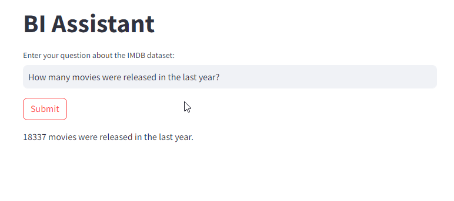

# BI Assistant

## Overview

Our aim is to develop a versatile Business Intelligence (BI) assistant capable of responding to free-text BI questions by utilizing the IMDB dataset as an SQL query.

LangChain provides tools to interact with SQL Databases:
1. Build SQL queries based on natural language user questions
2. Query a SQL database using chains for query creation and execution
3. Interact with a SQL database using agents for robust and flexible querying


## Dataset

We will utilize the non-commercial IMDB dataset, accessible [here](https://developer.imdb.com/non-commercial-datasets/).

## Examples of BI Questions that use for testing the model

1. How many movies were released in the last year?
2. How many actors were born in 2001?
3. What is the language of the movie "Pulp Fiction"?
4. What is the series with the most episodes?
5. In how many horror movies did Sean Connery perform?

## Part I: Proposal for BI Assistant Solution

### High-Level Architecture

#### Frameworks

Our proposed solution will leverage the following frameworks:
- **Langchain using SQLDatabaseChain**: LangChain is an open-source framework that allows developers to combine large language models with external components for developing Language Model (LM)-powered applications.
- **Streamlit**: An open-source Python framework for creating interactive data apps in minutes.

#### Models & Algorithms

For the BI assistant, we'll employ the following models and algorithms:
- **OpenAI GPT-3.5-turbo-instruct**: A powerful language model from OpenAI for natural language processing.

#### Databases

We will use **SQLite** for storing and querying the IMDB dataset.

### Preprocessing Stage and Question Answering Flow
---------------------------
> ### :warning: **IMPORTANT:** The following steps are comprehensively detailed in the notebook named "flow_steps.ipynb." I recommend reviewing it to gain a deeper understanding of the entire workflow. Each step is thoroughly explained, providing valuable insights into the process.


1. **Convert the dataset to SQL database**
   - Utilizing the `imdb-sqlite` Python module for seamless conversion of TSV files to SQLite format.
   - This module streamlines the process by renaming columns, handling null values, and adding relevant indexers.
   - [Here's how to install it](https://pypi.org/project/imdb-sqlite/).

2. **Analyzing IMDB Data with SQL Queries**
   - Executing SQL queries to answer the BI questions.
   - These responses will serve as valuable benchmarks for future comparisons with the assistance of the Language Model (LLM).

3. **Utilizing Langchain with 'SQLDatabaseChain' for Querying Plain Text Questions**
   - Integrating Langchain to enable querying the IMDB dataset with plain text questions.

4. **Analysis of LLM Query Responses**: Reviewing query results from the Language Model (LM) to identify areas of improvement and proposing enhancements.

5. **LLM Improvements**
   - To enhance the precision of the Language Model (LLM), I have modified the default prompt by:
        - Adding more information on the tables schema; these additions aim to provide the model with a better understanding of the data.
        - Using 'partial_variables' that help to pass functions like `_get_datetime()`, so the LLM is aware of the current date.

### Consideration of Alternatives / Future Improvements
---------------------------

- **Frameworks Evaluation:**
  - Initially, we considered the "SQL agent" framework due to its greater flexibility and advantages, as described [here](https://python.langchain.com/docs/use_cases/qa_structured/sql#case-3-sql-agents). However, after testing, we found subpar results compared to the SQLDatabaseChain. Managing and updating prompts also proved to be more complex with the SQL agent. Consequently, we opted to continue with the 'SQLDatabaseChain.

- **Model/Algorithm Exploration:**
  - Future improvements may involve testing other models, such as GPT-4 or models specifically fine-tuned for SQL tasks. This exploration could enhance the BI assistant's capabilities and accuracy.

- **Dataset size:**
  - It is advisable to conduct model testing with a substantial dataset (more than 5 examples), preferably consisting of several hundred examples. It is also recommended to partition the dataset into distinct training and test sets to prevent overfitting on the training data. Furthermore, the evaluation should include the use of relevant metrics to assess the model's performance

- **Scaling for Larger Databases:**
  - While the current approach works well for small datasets like IMDB, scaling to larger databases with numerous tables and columns may encounter limitations due to the maximum input token capacity of the Language Model (LLM). Exploring a RAG architecture, embedding table schemas with descriptions, storing them in a vectorDB, and retrieving appropriate tables using query-by-similarity could be a viable solution for handling larger datasets.

- **Database Choice Consideration:**
  - The choice of SQLite was based on its ease of use and serverless nature. However, it's essential to acknowledge its limitations in scenarios requiring high concurrency, extensive scalability, and feature-rich capabilities. PostgreSQL might be a more suitable alternative in such cases.

- **Indexing Improvement:**
  - Future efforts can be directed towards enhancing database indexes for optimized query performance. Efficient indexing can significantly contribute to faster and more efficient data retrieval.

- **Prompt Refinement:**
  - Continuous improvement of the prompt is crucial for a better understanding of the data. Adding detailed descriptions to each table, specifying primary and foreign keys, and refining the prompt language can contribute to improved query accuracy and overall performance.


## Part II: How to Run the App

Follow these steps to run the BI assistant app:

1. **Install Python:**
   - Ensure that Python is installed on your computer. If not, you can download and install it from the [official Python website](https://www.python.org/downloads/).

2. **Create a Virtual Environment:**
   - It's recommended to create a virtual Python environment to manage dependencies. You can create a virtual environment using the following commands:
     ```bash
     python -m venv venv
     ```

3. **Install Dependencies:**
   - Navigate to the root of the project and install the required libraries by running the following command:
     ```bash
     pip install -r requirements.txt
     ```

4. **Configure API Key and Database URI:**
   - Open the `config.py` file and add your OpenAI API key and the URI to the SQLite database. The database URI should be in the format:
     ```python
     "sqlite:///{name_of_your_db}.db"
     ```
     Be sur that your db file is located under the root of the project.

5. **Run the App:**
   - Execute the following command to run the app:
     ```bash
     streamlit run app.py
     ```

6. **Enjoy!**
   - The app should now be running. Open your web browser and go to the provided URL to interact with the BI assistant.

Additionally, find some screenshots of the app testing BI questions above to get a visual overview of the app's functionality.




